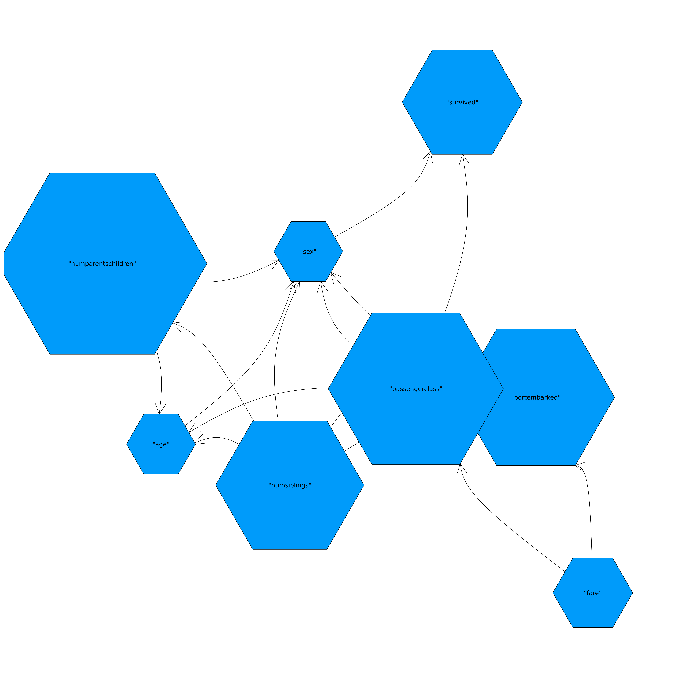
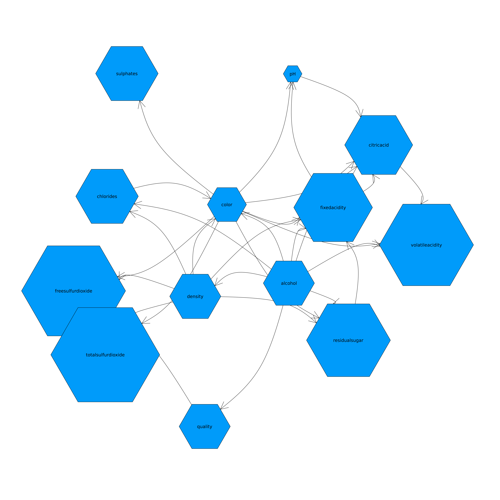
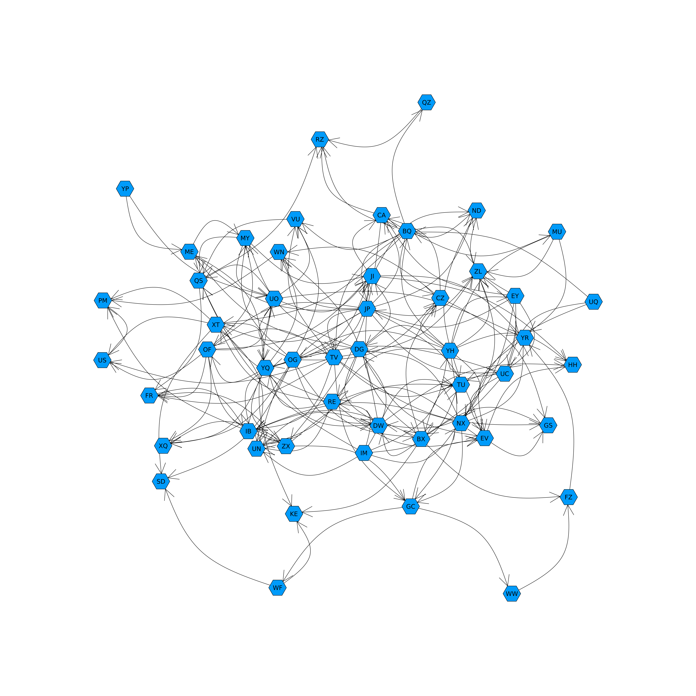

<!-- 

Description of algorithm – 10%
Running time for each problem – 10%
Visualization of each graph – 10%
Code (included in PDF) – 10% -->

# Script Flow
1. Checks cache folder for the current optimal graph, and imports
2. Runs algorithm to get a new graph
3. If Bayesian score of new graph is better, save it as the new optimal graph
4. Save and plot new graph

# Algorithm Description
- Run K2 with a certain amount of "restarts", selecting the best one
- Run local search optimization on the resulting graph for a certain number of iterations

I chose to run both algorithms in order to achieve randomness of restarting the node ordering. However, to save time on larger graphs, and to optimize around the "best" current graph, I added local search optimization to optimize around this ordering. 

# Running time
The following running times were acheived:

### small.csv
Running with 100 restarts and 1000 local searches:
```
real	0m19.524s
user	0m19.207s
sys	0m0.643s
```

### medium.csv
Running with 10 restarts and 1000 local searches:
```
real	0m37.706s
user	0m37.270s
sys	0m0.751s
```

### large.csv
Running with 1 restart and 300 local searches:
```
real	3m8.609s
user	3m4.921s
sys	0m1.961s
```

# Plots 

### small.csv

### medium.csv

### large.csv



## Potential improvements
Although I did not have the time to implement it, an idea that I had for another algorithm is as follows:
1. Pick random ordering of nodes and run K2
   - Repeat steps X amount of times, and take top 10%
2. Run local search on those until the the score does not improve in Y iterations
3. For optimized results, remove half of the edges, and repeat step 2 (Z amount of times so that the edge removals are random)
   1. Repeat step 3, but each subsequent time, half the amount of edges removed
   2. When one graph remains, it is the winner


# Code

## Project1.jl
This is the module with all of the functions
```
module Project1

using Graphs
using Printf
using LinearAlgebra
using SpecialFunctions
using Random

#######################################################
#   Datatypes
#######################################################

mutable struct Variable
    name::Symbol
    r::Int # number of possible values
end

struct LocalDirectedGraphSearch
    G::SimpleDiGraph # initial graph
    k_max::Int # number of iterations
end

#######################################################
#   Importing and Exporting
#######################################################

function import_data(filename::String)::Tuple{Vector{Variable}, Matrix{Int}}

    nodes = Vector{Variable}()
    samples = Vector{Vector{Int}}()

    open(filename, "r") do io

        # Break if the file is empty
        header = readline(io)
        if eof(io)
            return nodes, Matrix{Int}(undef, 0, 0)
        end


        # Parse node names, setting default to 1 possible value
        node_names = split(header, ',')
        nodes = [Variable(Symbol(name), 1) for name in node_names]

        # Parse samples
        for line in eachline(io)
            single_sample = parse.(Int, split(line, ','))
            push!(samples, single_sample)
        end
    end

    # Convert samples to a Matrix
    if !isempty(samples)
        num_samples = length(samples)
        sample_matrix = Matrix{Int}(undef, length(nodes), num_samples)
        
        for i in 1:num_samples
            sample_matrix[:, i] = samples[i]
        end
    else
        sample_matrix = Matrix{Int}(undef, 0, 0)
    end

    # Max values
    for (i, var_values) in enumerate(eachrow(sample_matrix))
        nodes[i].r = maximum(var_values)
    end

    return nodes, sample_matrix
end

"""
    write_gph(dag::DiGraph, idx2names, filename)

Takes a DiGraph, a Dict of index to names and a output filename to write the graph in `gph` format.
"""
function write_gph(dag::DiGraph, idx2names::Vector{String}, filename::String)
    open(filename, "w") do io
        for edge in edges(dag)
            @printf(io, "%s,%s\n", idx2names[src(edge)], idx2names[dst(edge)])
        end
    end
end

#######################################################
#   Utility Functions
#######################################################

# From book (with TA recommendation)
function sub2ind(siz, x)
    k = vcat(1, cumprod(siz[1:end-1]))
    return dot(k, x .- 1) + 1
end

function statistics(nodes::Vector{Variable}, graph::SimpleDiGraph, data::Matrix{Int})
    n = size(data, 1)
    r_i = [nodes[i].r for i in 1:n]

    q_i = [ # Parental instantiations for each node
        prod([r_i[i] for i in inneighbors(graph,node)]) 
        for node in 1:n]

    # List of counts matrices
    M = [zeros(q_i[i], r_i[i]) for i in 1:n]

    # Iterate through all each variable
    for node_data in eachcol(data)
        for node_num_i in 1:n
            k = node_data[node_num_i]
            parents = inneighbors(graph, node_num_i)

            parental_instantiations_j = 1       # Default case of no parents
            if length(parents) > 0
                parental_instantiations_j = sub2ind(r_i[parents], node_data[parents])
            end
            
            M[node_num_i][parental_instantiations_j, k] += 1
        end
    end

    return M
end

function prior(nodes::Vector{Variable}, graph::SimpleDiGraph)
    n = length(nodes)
    r_i = [nodes[i].r for i in 1:n]

    q_i = [ # Parental instantiations for each node
        prod([r_i[i] for i in inneighbors(graph,node)]) 
        for node in 1:n]

    return [ones(q_i[i], r_i[i]) for i in 1:n]
end

#######################################################
#   Bayesian Score
#######################################################

function summation_of_parent_edges_q_i(M, α)

    # First summation with the ij0 terms (sum of all ijk)
    result = sum(loggamma.(sum(α,dims=2)))
    result -= sum(loggamma.(sum(α,dims=2) + sum(M,dims=2)))

    # Second summation through each sample (ijk)
    result += sum(loggamma.(α + M))
    result -= sum(loggamma.(α))

    return result
end
function bayesian_score(nodes::Vector{Variable}, graph::DiGraph, samples::Matrix{Int})
    n = length(nodes)
    M = statistics(nodes, graph, samples) # Obtain count matrices
    α = prior(nodes, graph) # Obtain pseudocount matrices (our prior dictates all elements should be 1)
    return sum(
        summation_of_parent_edges_q_i(M[node_i], α[node_i]) # Function sums the counts from parent edges (q_i)
        for node_i in 1:n # For each node i
    )
end

function compute(nodes::Vector{Variable}, samples::Matrix{Int}, starting_graph::DiGraph, retries = 100, local_iterations = 500)

    best_score = -Inf
    best_graph = nothing
    best_ordering = nothing

    # Retry K2 and get optimal score
    for _ in 1:retries
        k2_ordering::Vector{Int} = shuffle(1:length(nodes))

        graph = k2_algorithm(k2_ordering, nodes, samples)
        score = bayesian_score(nodes, starting_graph, samples)

        if score > best_score
            best_score = score
            best_graph = graph
            best_ordering = k2_ordering
        end
    end

    # Local search around optimal score
    method = LocalDirectedGraphSearch(best_graph, local_iterations)
    graph = local_random_search(method, nodes, samples)
    score = bayesian_score(nodes, graph, samples)
    return graph, score, best_ordering
end

#######################################################
#   K2 Algorithms
#######################################################

function rand_graph_neighbor(graph, max_nodes::Int)
    n = nv(graph) # Number of vertices
    i = rand(1:n)
    j = mod1(i + rand(2:n)-1, n)
    new_graph = copy(graph)

    # Remove if max edges, or edge already exists
    if outdegree(graph, i) > max_nodes || has_edge(new_graph, i, j)
        rem_edge!(new_graph, i, j)
    else
        add_edge!(new_graph, i, j)

    end

    return new_graph
end

function local_random_search(method::LocalDirectedGraphSearch, nodes::Vector{Variable}, samples::Matrix{Int}, max_nodes::Int = 15)
    graph = method.G
    current_score = bayesian_score(nodes, graph, samples)
    for iter in 1:method.k_max
        # println("Local iteration $iter")
        new_graph = rand_graph_neighbor(graph, max_nodes)
        if is_cyclic(new_graph)
            new_score = -Inf
        else
            new_score = bayesian_score(nodes, new_graph, samples)
        end

        if new_score > current_score
            score, graph = new_score, new_graph
        end
    end

    return graph
end


function k2_algorithm(k2_ordering::Vector{Int}, nodes::Vector{Variable}, samples::Matrix{Int}, iterations::Int = 100000, max_nodes::Int = 15)
    n = length(nodes)

    # Empty graph, to add nodes to
    graph = SimpleDiGraph(n)

    # For all nodes in the order
    for (curr_node_index,node_i) in enumerate(k2_ordering[2:end])
        best_score = bayesian_score(nodes, graph, samples::Matrix{Int}) # Baseline score

        # Find parent edges that add to the score
        iter = 0
        while true
            current_score, best_parent_j = -Inf, 0

            # Loops through potential parents
            for parent_j in k2_ordering[1:curr_node_index]

                # Adds an edge if it improves the score
                if !has_edge(graph, parent_j, node_i)
                    add_edge!(graph, parent_j, node_i)
                    test_score = bayesian_score(nodes, graph, samples::Matrix{Int})
                    if !is_cyclic(graph) && test_score > current_score
                        current_score, best_parent_j = test_score, parent_j
                    end
                    rem_edge!(graph, parent_j, node_i)
                end
            end
            
            if current_score > best_score
                best_score = current_score
                add_edge!(graph, best_parent_j, node_i)
            else
                break
            end

            iter += 1
            if iter == iterations
                break
            end
        end
        println("Stopped after $iter iterations on node $node_i: $best_score")
    end
    return graph
end


end # module Project1
```

## run.jl
This script calls the Julia module Project1.jl

```
using Project1: import_data, compute, write_gph, bayesian_score
using Graphs, GraphRecipes, Plots


#######################################################
#   Args
#######################################################

if length(ARGS) != 3
    error("usage: julia src/run.jl data/<infile>.csv [k2 retries] [local optimization runs]")
end

inputfilename = ARGS[1]
retries = parse(Int,ARGS[2])
local_iterations = parse(Int, ARGS[3])

cache_name = split(inputfilename, "/")[end]
cache_name = "cache/" * split(cache_name, ".")[1] * ".gph"

plot_filename = split(inputfilename, "/")[end]
plot_filename = "plots/" * split(plot_filename, ".")[1] # plot automatically adds png

outputfilename = split(inputfilename, "/")[end]
outputfilename = "graphs/" * split(outputfilename, ".")[1] * ".gph"

#######################################################
#   Importing 
#######################################################

nodes, samples = import_data(inputfilename)

old_graph = DiGraph() # default graph
order = Vector(range(1,length(nodes)))
old_score = -Inf

# Imports graph from cache if it exists
if isfile(cache_name)

    # Grab file and import header and data
    imported_graphs, order = open(cache_name, "r") do io
        order = eval(Meta.parse(readline(io)))
        graph = loadgraphs(io, LGFormat())
        return graph, order
    end

    if length(imported_graphs) == 0
        println("Imported file has no graphs. Defaulting to empty.")

    else
        old_graph = imported_graphs["graph"]
        old_score = bayesian_score(nodes, old_graph, samples)
        graph = old_graph
        
        println("Imported graph with $(nv(old_graph)) nodes")
        println("with score of $(bayesian_score(nodes, old_graph, samples))")
        println("and node order of $order")
    end
end

#######################################################
#   Importing 
#######################################################

# Computes new graph with score and order

graph, score, order = compute(nodes, samples, graph, retries, local_iterations)
println("Calculated score of $score")

# #######################################################
# #   Saving Cache
# #######################################################

# Save if new score is better

if score > old_score
    println("New graph score of ($score) is better than old score ($old_score). Saving...")
    open(cache_name, "w") do io
        println(io, order)
        savegraph(io, graph, "graph", LGFormat())
    end
else
    println("New graph score of ($score) was not better than old score ($old_score)")
end

#######################################################
#   Saving Graph 
#######################################################

node_names = [string(n.name) for n in nodes]

write_gph(graph, node_names, outputfilename)

graphplot(graph, names=node_names,size=(2000, 2000), dpi=300,
          nodesize=0.2,
          fontsize=12)
png(plot_filename)
```